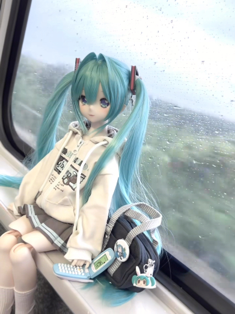

# Introduction

Hi! I'm Han Yifeng, a Software Engineering student.

I expect to learn practical software maintenance techniques and how to improve existing software.

- **Fun fact**: I like playing basketball and hanging out with friends in my free time 
- **Course expectations**: To gain hands-on experience in maintaining and evolving software.

